# 01 · When to tune, and when the answer is no

Fine-tuning is the most requested and least justified step in applied AI.

It gets proposed because it sounds like the serious answer. "We wrote a better prompt" survives a steering-committee slide badly; "we trained our own model" survives it well. That asymmetry is doing more work in most tuning decisions than any technical argument.

This document is the argument for climbing the ladder one rung at a time, and the numbers that tell you when to stop.

---

## The ladder

Each rung costs roughly an order of magnitude more than the one below — in engineering time far more than in GPU spend — and each is only worth climbing when the rung below has demonstrably run out of room.

```mermaid
flowchart TD
    P["0 · PROMPT<br/><i>instructions, format, constraints</i>"]
    F["1 · FEW-SHOT<br/><i>curated exemplars</i>"]
    R["2 · RETRIEVAL<br/><i>give it the facts</i>"]
    T["3 · TOOLS<br/><i>give it the system of record</i>"]
    D["4 · DISTILL<br/><i>big model → small model</i>"]
    S["5 · SFT<br/><i>behaviour prompts can't reach</i>"]
    Q["6 · PREFERENCE<br/><i>taste you can rank, not state</i>"]
    C["7 · CONTINUED PT<br/><i>a genuinely new domain</i>"]

    P --> F --> R --> T --> D --> S --> Q --> C

    style P fill:#0d2818,stroke:#238636,stroke-width:2px
    style F fill:#0d2818,stroke:#238636,stroke-width:2px
    style R fill:#0d2818,stroke:#238636,stroke-width:2px
    style T fill:#0d2818,stroke:#238636,stroke-width:2px
    style D fill:#3d1d00,stroke:#bf8700,stroke-width:2px
    style S fill:#3d1d00,stroke:#bf8700,stroke-width:2px
    style Q fill:#4d0f0f,stroke:#da3633,stroke-width:2px
    style C fill:#4d0f0f,stroke:#da3633,stroke-width:2px
```



**Green rungs are reversible.** A prompt change ships in an afternoon and rolls back in a minute. **Amber and red rungs change weights**, and that is the line where an engineering decision becomes a governance one: a tuned model needs a data lineage record, an approval, and a place in the model inventory. Nobody tells you that at the start.

---

## Diagnose the failure before you price the fix

Almost every misdirected tuning project starts by skipping this step. The question is not "should we fine-tune" — it is **"what exactly is the model getting wrong, and why."**

| The model... | The failure is | The rung | Why not tuning |
|---|---|---|---|
| States facts confidently and wrongly | **Missing knowledge** | Retrieval | Weights are a bad place for facts. They go stale, they can't be cited, and correcting one means a retrain |
| Can't answer "what is the status right now" | **Missing access** | Tools | No amount of training teaches a model today's balance |
| Is accurate but too slow or too expensive | **Economics** | Distillation | You don't need it smarter. You need it cheaper at one narrow task |
| Ignores your format after real prompt iteration | **Behaviour** | SFT | This one is genuinely a tuning problem |
| Produces output reviewers reject for reasons they can't articulate | **Unstateable taste** | Preference | If you *can* state the rule, state it in the prompt — that's reversible |
| Doesn't recognise domain vocabulary at all | **Novel domain** | Continued pretraining | Rare. Prove it by showing the base model failing on terms it should know |

**Run the diagnosis in code:**

```bash
python examples/01-decide/decide.py
```

Four scenarios. Three of them sound like tuning problems in a planning meeting. One is.

---

## The preconditions are not advisory

Before any weight-changing rung, three things must be true. The toolkit treats them as **blockers**, not warnings — a recommendation with blockers is a *not yet*, regardless of how good the case looks.

**1 · You have an eval set that would detect the improvement.**

Tuning without an eval is not a risky experiment. It's an unmeasurable one, which is worse, because you will ship it anyway and attribute whatever happens next to it. See [02 · Evaluation first](02-evaluation-first.md).

**2 · You have actually iterated on the prompt.**

"We tried a few things" is not a systematic pass. Three or more real revisions, measured against the eval set, before you spend a rung.

**3 · You have enough human-reviewed examples.**

Roughly 500 as a floor for SFT, ~1,000 ranked pairs for preference tuning. These are floors, not targets, and they assume curation. **A thousand scraped rows are worth less than a hundred curated ones** — see [03 · Data curation](03-data-curation.md).

---

## The economics, including the line people forget

The usual business case compares per-token prices and stops. That comparison is missing the term that decides most real cases.

```
monthly saving = (prompted cost) − (tuned cost) − (cost of OWNING a tuned model)
```

That third term is not small. It is the eval reruns, the drift checks, the re-tune when the base model version moves under you, and the engineer who remembers how any of it works. Budget it as a real monthly line, because it is one.

Two runs of the same model, same per-token advantage, same setup cost:

| | 4,000,000 req/month | 25,000 req/month |
|---|---|---|
| Prompted, large model | $19,800 / mo | $124 / mo |
| Tuned, small model | $4,700 / mo | $3,508 / mo |
| Monthly saving | **$15,100** | **−$3,384** |
| One-time setup | $45,000 | $45,000 |
| **Breakeven** | **3.0 months** | **never** |

The low-volume column is the finding. Tuning didn't fail there — **it was never going to work**, and thirty seconds of arithmetic says so before anyone spends a quarter discovering it.

> **The setup cost is human time, not GPU time.** Compute is usually the rounding error, which is the opposite of what people expect and the reason these business cases come in low. The expensive part is producing and reviewing the data.

---

## Ten things that surprise people

1. **Most "fine-tuning problems" are retrieval problems.** The model doesn't lack capability; it lacks the document.
2. **Distillation is the most defensible reason to change weights** and the least discussed. You're not making it smarter, you're making it cheaper at one task.
3. **Data quality beats hyperparameters, and it isn't close.** Rank 8 on curated data beats rank 64 on scraped data every time.
4. **A duplicated example silently doubles its own influence.** Scraped sets routinely arrive 10–30% duplicated.
5. **Eval contamination makes your score go *up*,** so nobody investigates. It is the only bug in this field that gets rewarded.
6. **Tuning for one behaviour degrades adjacent ones.** If you're not measuring per-capability, you can't see it, and the aggregate hides it by construction.
7. **PII in training data is not a bug you patch later.** It's in the weights, it's extractable, and no deletion request reaches it.
8. **Three epochs is usually the ceiling** on a curated set. Beyond that you're memorising, and the eval is too small to tell you.
9. **The monthly cost of owning a tuned model** can exceed the entire per-token saving. See the table above.
10. **The base model moves under you.** Your tune was against a version. When it's deprecated, you re-tune — and that clock started the day you shipped.

---

**Next:** [02 · Evaluation first](02-evaluation-first.md) — the step that has to come before this decision is even answerable. Run it: [`examples/03-evaluate/`](../examples/03-evaluate/).
